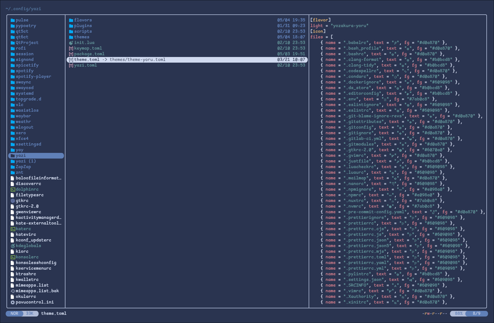
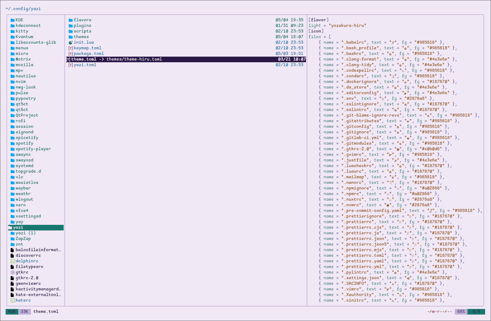

<div align="center">


# 夜桜 Yozakura — yazi Theme

A handcrafted pastel color palette for [yazi](https://github.com/sxyazi/yazi), based on the [Yozakura](https://shunsui18.github.io/yozakura) palette.

[](LICENSE)
[](https://github.com/sxyazi/yazi)
[](install.sh)
[](https://github.com/shunsui18/yozakura)

</div>

---

## ✦ Flavors

| | Flavor | Description | |
|---|---|---|---|
| 🌙 | **Yoru** *(night)* | Deep, moonlit background with soft sakura accents | [→ README](yozakura-yoru.yazi/README.md) |
| ☀️ | **Hiru** *(day)* | Warm ivory canvas with gentle pastel tones | [→ README](yozakura-hiru.yazi/README.md) |

---

## ✦ Previews

<table>
<tr>
<td align="center"><b>🌙 Yoru</b></td>
<td align="center"><b>☀️ Hiru</b></td>
</tr>
<tr>
<td></td>
<td></td>
</tr>
</table>

---

## ✦ Installation

### Method 1 — One-liner (recommended)

Install directly from this repository with a single command:

```bash
bash <(curl -fsSL https://raw.githubusercontent.com/shunsui18/yazi/main/install.sh)
```

> Running without flags launches an **interactive menu** to pick your flavor.

---

### Options

| Flag | Values | Description |
|---|---|---|
| `--theme` | `yoru` \| `hiru` | Skip the menu and activate a specific flavor directly |
| `--no-backup` | — | Skip backing up your existing `theme.toml` |
| `-h`, `--help` | — | Show help and list available flavors |

---

### Examples

```bash
# interactive menu
bash <(curl -fsSL https://raw.githubusercontent.com/shunsui18/yazi/main/install.sh)

# skip menu — yoru (night)
bash <(curl -fsSL https://raw.githubusercontent.com/shunsui18/yazi/main/install.sh) --theme yoru

# skip menu — hiru (day)
bash <(curl -fsSL https://raw.githubusercontent.com/shunsui18/yazi/main/install.sh) --theme hiru
```

---

### Method 2 — `ya pkg` (manual theme activation)

Install a specific flavor directly via yazi's package manager. Full instructions — including the `[flavor]` activation step, icon setup, and per-flavor commands — live in each flavor's own README:

- 🌙 [yozakura-yoru — `ya pkg` install](yozakura-yoru.yazi/README.md#-installation-via-ya-pkg)
- ☀️ [yozakura-hiru — `ya pkg` install](yozakura-hiru.yazi/README.md#-installation-via-ya-pkg)

---

### Method 3 — Use the provided `theme.toml` directly

The repo ships a ready-made `theme.toml` that already contains both the `[flavor]` block and the full `[icon]` section. You can drop it straight into your yazi config — no manual editing needed.

**Copy it:**
```bash
cp theme.toml ~/.config/yazi/theme.toml
```

**Or symlink it** (changes in the repo reflect instantly):
```bash
ln -sf "$(pwd)/theme.toml" ~/.config/yazi/theme.toml
```

> The repo's `theme.toml` is itself a symlink to `yozakura-yoru.yazi/theme.toml` (night flavor). To use the day flavor instead, point your symlink to `yozakura-hiru.yazi/theme.toml`.

---

### Method 4 — Manual Installation

If you prefer to install by hand:

```bash
# 1. Clone the repo
git clone https://github.com/shunsui18/yazi.git && cd yazi

# 2a. Interactive menu
bash install.sh

# 2b. Or pass a flavor directly
bash install.sh --theme yoru
```

---

## ✦ What the Installer Does (Methods 1 & 4)

1. **Self-locates** — resolves its own path; in remote mode fetches all theme files from GitHub into a temp directory automatically
2. **Prompts** — shows an interactive flavor menu if no `--theme` flag is given; accepts a number or flavor name
3. **Validates** — confirms the requested flavor's files exist before touching anything
4. **Backs up** your existing `~/.config/yazi/theme.toml` (timestamped) before making any changes — pass `--no-backup` to skip
5. **Creates** the full directory tree under `$HOME/.config/yazi/` if not already present
6. **Copies** all flavor files into `~/.config/yazi/flavors/` (yazi expects them there regardless of where they live in the repo):
   - `flavor.toml` — flavor metadata
   - `theme.toml` — full color theme
   - `tmtheme.xml` — syntax highlighting colors
7. **Symlinks** the active flavor — `theme.toml` points to the chosen variant, making flavor-switching a single re-run away
8. **Fails gracefully** — descriptive error messages if arguments are wrong or files are missing

---

## ✦ File Structure

```
yazi/
├── assets/
│   ├── yazi-yoru-preview.png
│   └── yazi-hiru-preview.png
├── yozakura-yoru.yazi/
│   ├── flavor.toml
│   ├── theme.toml
│   └── tmtheme.xml
├── yozakura-hiru.yazi/
│   ├── flavor.toml
│   ├── theme.toml
│   └── tmtheme.xml
├── theme.toml  →  yozakura-yoru.yazi/theme.toml  (symlink, active flavor)
├── install.sh
├── LICENSE
└── README.md
```

---

<div align="center">

crafted with 🌸 by [shunsui18](https://github.com/shunsui18)

</div>
